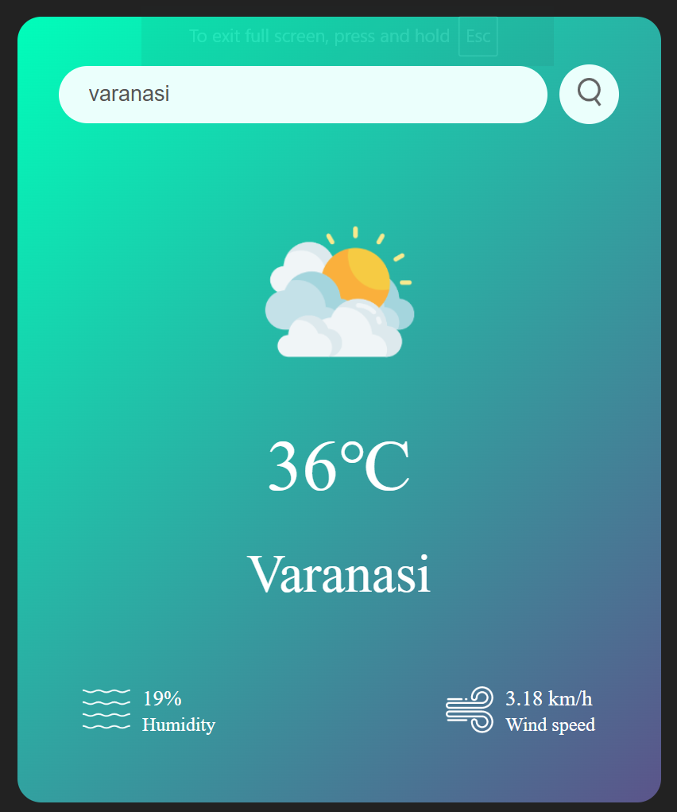

# 🌦️ Weather Forecast App

A simple and clean weather forecast web application that allows you to search any city and get real-time weather details like temperature, humidity, and wind speed. Built with **HTML, CSS, and JavaScript** using the OpenWeatherMap API.

---

## 🚀 Live Demo

👉 [Click here to view the live site!](https://n-i-3.github.io/Weather-forecast/)

---

## 🖼️ Preview

---

## 💡 Features

✅ Real-time weather updates  
✅ Dynamic temperature, humidity, and wind display  
✅ Weather icons change based on condition  
✅ Simple & responsive design  

---

## ⚙️ Tech Stack

- HTML
- CSS
- JavaScript (ES6)
- OpenWeatherMap API

---
